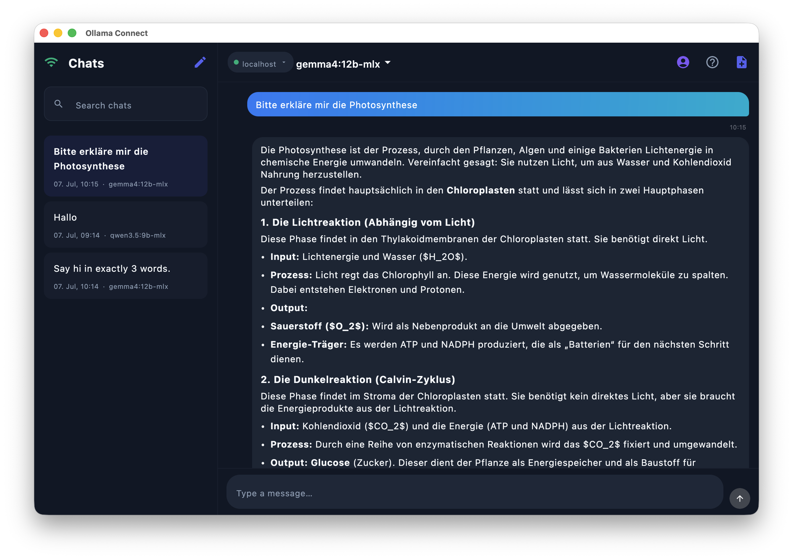
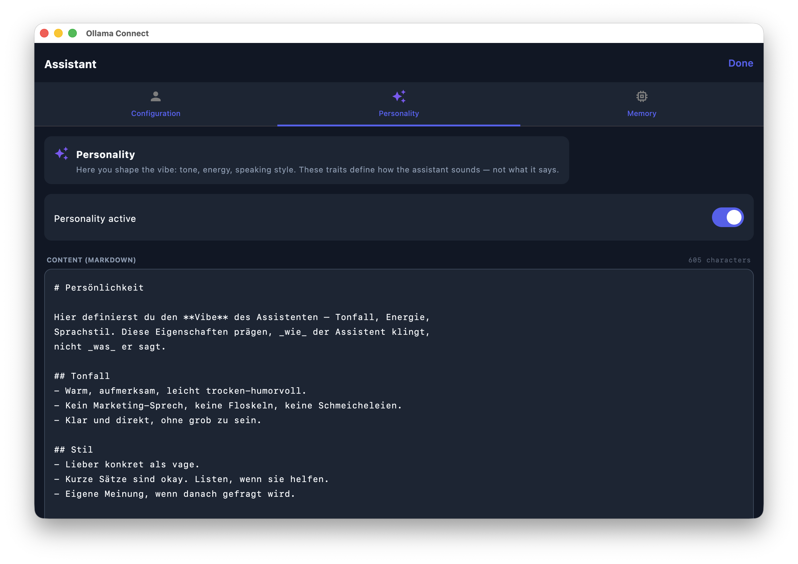

# Ollama Connect

A fast, private, cloud-free chat client for your own [Ollama](https://ollama.com) or [llama-server](https://github.com/ggml-org/llama.cpp) instance — built with Kotlin Multiplatform and Compose Multiplatform. One codebase, native apps on **macOS, Windows, Linux, and Android**.

Talk to any model your server hosts, right from your Mac, PC, phone, or tablet — no data ever leaves your network.

## Screenshots

<p align="center">
  
  
</p>

## Features

- **Two backends, one app** — connect to a native Ollama server or an OpenAI-compatible `llama-server` (`/v1/chat/completions`); switch per connection.
- **Streaming chat** with Markdown rendering, syntax-highlighted code blocks, and one-tap code copy.
- **Full model parameter control** — temperature, Top-K, Top-P, Min-P, presence penalty, and context window/token limits, all live-adjustable.
- **Presets** — built-in, tuned presets for Gemma 4 and Qwen3.6 (thinking & instruct), plus your own custom presets.
- **Assistant persona system** — separate, independently toggleable Configuration / Personality / Memory blocks, stored as plain Markdown files you can edit by hand. The assistant can append to its own memory mid-chat via a hidden `<remember>` tag.
- **Chat history** — searchable, renamable, exportable (as Markdown), with per-chat model and system prompt.
- **Saved connections** — recently used servers are remembered per type (Ollama / llama-server) for one-tap reconnects.
- **Localized** — English and German, following your system language automatically (falls back to English for everything else).
- **No cloud, no telemetry** — every request goes straight from your device to your own server.

## Download

Grab the build for your platform from the [latest release](https://github.com/betzburger/ollama-connect/releases/latest):

| Platform | File | Notes |
|---|---|---|
| macOS (Apple Silicon) | [Ollama-Connect-2.0.0-macOS-arm64.dmg](https://github.com/betzburger/ollama-connect/releases/latest/download/Ollama-Connect-2.0.0-macOS-arm64.dmg) | Unsigned — see [macOS install notes](#macos) below |
| Windows (x64) | [Ollama-Connect-2.0.0.msi](https://github.com/betzburger/ollama-connect/releases/latest/download/Ollama-Connect-2.0.0.msi) | Standard MSI installer |
| Linux (x86_64) | [Ollama-Connect-2.0.0-x86_64.AppImage](https://github.com/betzburger/ollama-connect/releases/latest/download/Ollama-Connect-2.0.0-x86_64.AppImage) | `chmod +x` then run |
| Linux (ARM64, e.g. Raspberry Pi) | [Ollama-Connect-2.0.0-aarch64.AppImage](https://github.com/betzburger/ollama-connect/releases/latest/download/Ollama-Connect-2.0.0-aarch64.AppImage) | `chmod +x` then run |
| Android | [Ollama-Connect-2.0.0-android-debug.apk](https://github.com/betzburger/ollama-connect/releases/latest/download/Ollama-Connect-2.0.0-android-debug.apk) | Debug-signed — enable "Install unknown apps" |
| Any desktop OS/arch (Java 17+) | [ollama-connect-all-platforms-2.0.0.jar](https://github.com/betzburger/ollama-connect/releases/latest/download/ollama-connect-all-platforms-2.0.0.jar) | `java -jar ollama-connect-all-platforms-2.0.0.jar` |

### Installation notes

#### macOS

The app isn't notarized/signed with an Apple Developer certificate, so Gatekeeper will refuse to open it with a plain double-click. Either:

- Right-click (or Control-click) `Ollama Connect.app` → **Open** → **Open** again in the dialog, or
- Run `xattr -cr "/Applications/Ollama Connect.app"` after copying it to Applications.

#### Windows

Run the `.msi` and follow the installer. Windows SmartScreen may warn about an unrecognized publisher on first run — click **More info → Run anyway**.

#### Linux (AppImage)

```bash
chmod +x Ollama-Connect-2.0.0-x86_64.AppImage   # or the aarch64 build on ARM
./Ollama-Connect-2.0.0-x86_64.AppImage
```

No installation needed — it's a self-contained executable.

#### Android

This is a debug-signed APK (fine for sideloading, not published on the Play Store). Enable **Install unknown apps** for your browser/file manager, then open the downloaded APK. Requires Android 7.0 (API 24) or newer.

#### Universal JAR

Works on any desktop with a Java 17+ runtime installed, regardless of OS or CPU architecture:

```bash
java -jar ollama-connect-all-platforms-2.0.0.jar
```

## Connecting to your server

1. Make sure [Ollama](https://ollama.com) (default port `11434`) or `llama-server` (default port `8080`) is running and reachable from the device you're using.
2. Open the app, tap **Connect to server**.
3. Choose the server type, enter its IP address and port, then tap **Connect**.
4. Pick a model from the list and start chatting.

Recently used servers are saved automatically and can be re-selected with one tap.

## Building from source

Requirements: JDK 17, Android SDK (for the Android target).

```bash
git clone https://github.com/betzburger/ollama-connect.git
cd ollama-connect

# Run on desktop
./gradlew :composeApp:run

# Build an Android debug APK
./gradlew :composeApp:assembleDebug

# Build a macOS/Windows/Linux native distributable for the current OS
./gradlew :composeApp:createReleaseDistributable
```

> **Note:** the release/minified desktop build uses ProGuard. It requires JDK 17 specifically (ProGuard 7.2.2 can't parse class files from newer JDKs), and `jpackage` must be present on that JDK — Android Studio's bundled JetBrains Runtime doesn't ship it, so a full JDK distribution (e.g. `brew install openjdk@17`) is needed for local release builds.

## Architecture

Kotlin Multiplatform project targeting `androidTarget()` and `jvm("desktop")`, sharing all business logic and UI (Compose Multiplatform) in `commonMain`:

- **UI**: Compose Multiplatform (Material 3)
- **Networking**: Ktor client (OkHttp engine), streaming responses via `Flow`
- **Persistence**: plain JSON files (conversations, presets, saved hosts, settings) and Markdown files (assistant persona)
- **Localization**: Compose Multiplatform Resources (`values/` = English default, `values-de/` = German)

Platform-specific code (`androidMain`, `desktopMain`) is limited to storage paths, date formatting, and OS-level integration (share sheet, window icon, coroutine dispatchers).

## License

No license has been specified for this project yet. All rights reserved by the author unless stated otherwise.
